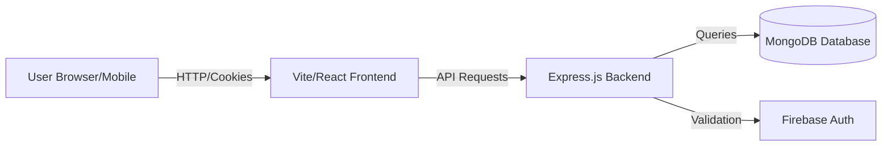

# QuizNova System Workflow

This document outlines the architecture and data flow between the QuizNova frontend and backend.

## 🚀 System Architecture

QuizNova follows a traditional Client-Server architecture with a focus on seamless, persistent user experiences.

---

## 🔑 Authentication Workflow

We use a hybrid authentication system designed to convert anonymous players into registered Google users with zero data loss.

### 1. Anonymous Participation (Guest Mode)
- **Startup**: When a user first opens the app, `App.jsx` checks for a session. If not found, it calls `/api/auth/guest`.
- **Backend**: Creates a `Guest` user in MongoDB and generates a 30-day secure **JWT Cookie**.
- **Persistence**: The browser stores the guest details and the cookie, allowing coins to be earned without logging in.

### 2. Google Account Integration (Merge Flow)
- **Action**: User clicks "Login with Google".
- **Validation**: Firebase handles the OAuth popup and returns an `idToken`.
- **Merging**:
    1. Frontend sends `idToken` + current `guestId` to `/api/auth/google`.
    2. Backend verifies token with Firebase Admin SDK.
    3. Backend finds/creates the Google user.
    4. **Merge**: Any coins/scores from the active `guestId` are added to the Google user's balance.
    5. The temporary Guest account is deleted.
- **Persistent Session**: A new secure cookie is issued for the Google user.

---

## 📡 Backend Workflow

The backend is built with **Node.js** and **Express**, serving as the central logic and data hub.

### Core Components:
- **`index.js`**: Main entry point. Configures CORS (with credentials), JSON parsing, and `cookie-parser`.
- **Auth Middleware (`protect`)**: Every sensitive request passes through this. It checks the `token` cookie or `Authorization` header to identify the user.
- **Controllers**:
    - `authController.js`: Manages Guest/Google logins and cookie issuance.
    - `questionController.js`: Fetches quiz data and categories.
    - `userController.js`: Submits scores and updates coin balances.

---

## 🎨 Frontend Workflow

The frontend is a **React** Single-Page Application (SPA) optimized for speed and visual "wow" factor.

### Application Lifecycle:
1. **Initialize (`App.jsx`)**: 
   - Attempts `getMe()` to check for an active cookie.
   - If 401 (not logged in), falls back to `authenticateGuest()`.
   - Once ready, renders the `Layout` and routes.
2. **Navigation**: Uses `react-router-dom` for smooth transitions between Categories, Quizzes, and Results.
3. **Quiz Execution**:
   - Fetches questions based on user-selected category and count.
   - Calculates score locally and submits via `submitScore()` API.
   - Triggers `coinsUpdated` event to refresh header balances globally.

---

## 💾 Data Flow: Submitting a Score

1. User finishes a quiz.
2. `ResultPage.jsx` calls `submitScore(correctCount)`.
3. Backend middleware verifies the user's session from the cookie.
4. `userController` calculates `coinsEarned` (10 per correct answer).
5. MongoDB profile is updated.
6. Frontend receives total coins back and updates UI instantly.
